#Jerusalem Bootcamp App

## Table of Contents

- [Jerusalem Bootcamp App](#jerusalem-bootcamp-app)

  - [Table of Contents](#table-of-contents)
  - [Acknowledgments](#acknowledgments)
  - [Overview](#overview)
  - [Live Demo](#live-demo)
  - [Features](#features)
  - [Tech Stack](#tech-stack)
  - [Screenshots](#screenshots)
    - [Home Screen](#home-screen)
    - [HTML Page Screen](#html-page-screen)
    - [CSS Page Screen](#html-page-screen)
    - [Javascript Page Screen](#javascript-page-screen)
    - [React Page Screen](#react-page-screen)
    - [Shared resources Page Screen](#shared-resources-page-screen)
    - [Login Page Screen](#login-page-screen)
    - [About Page Screen](#about-page-screen)
    - [Contact us Page Screen](#contact-us-page-screen)
  - [Getting Started](#getting-started)
  - [API Integration](#api-integration)
    - [Environment Variable Protection](#environment-variable-protection)
    - [Request Management](#request-management)
  - [Context Management](#context-management)
    - [Authentication Context](#authentication-context)
  - [Custom Hooks](#custom-hooks)
    - [`useGlobalAuthContext`](#useglobalauthcontext)
    - [`useLoginForm`](#useloginform)
    - [`usePageContent`](#usePageContent)

## Acknowledgments

This project is based on the [React Jerusalem Bootcamp](https://github.com/amalshweiki/bootcamp.git)

## Overview

"This is an application that allows users to select the category of sources they desire (HTML, CSS, JavaScript, React) and choose the type of resources (YouTube, Udemy courses, articles, and exercises)."

"HTML," "CSS," "JavaScript," and "React" are programming languages or technologies, so they are better referred to as categories or topics.
"YouTube," "Udemy courses," "articles," and "exercises" are types of resources.
"It also enables users to share resources."

## Live Demo

Visit the [live demo](https://elegant-dodol-e3dba2.netlify.app).

## Features

- User Authentication
- Custom Hooks
- Error Notifications

## Tech Stack

- React.js
- React Router
- Axios
- mockApi
-bootstrap

## Screenshots

---

### Home Screen

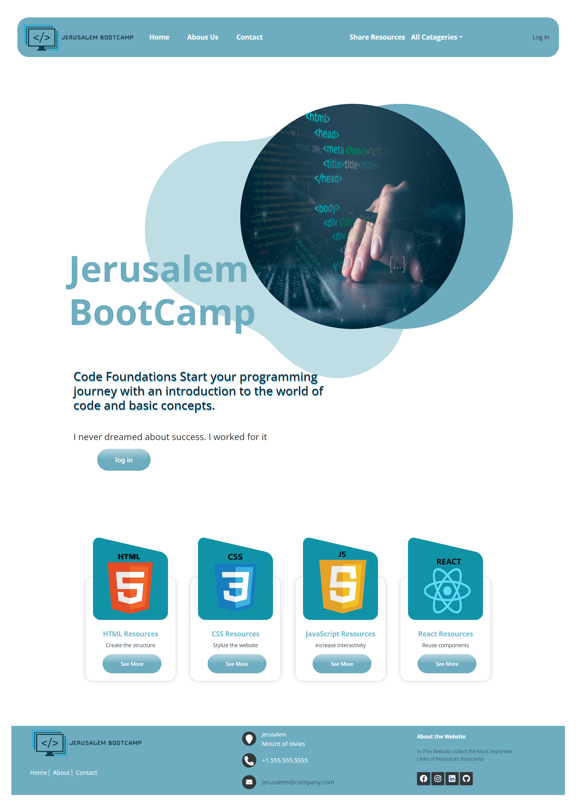

---

### Login Screen

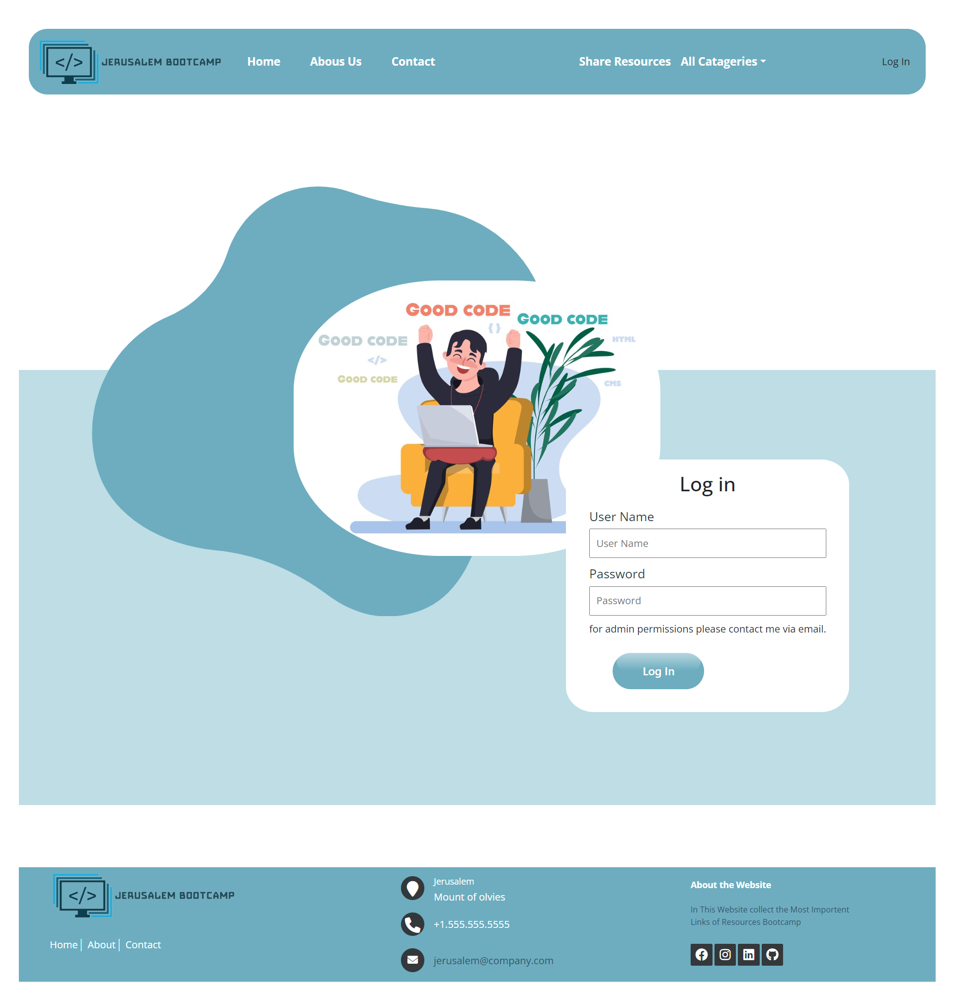

---

### Contact Screen

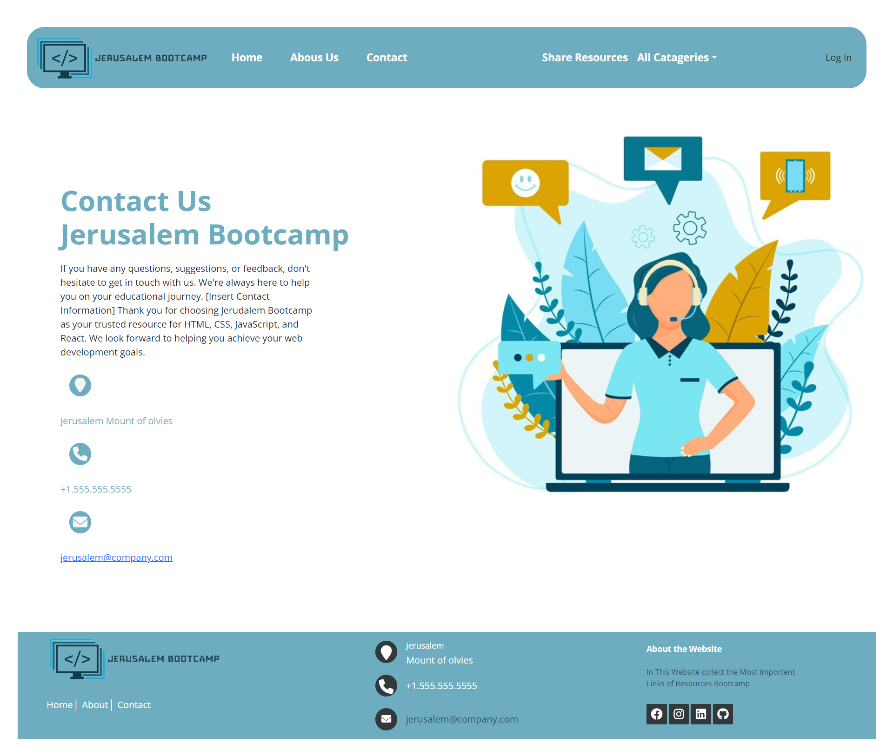

---

### About Us Screen

!About Us Screen](src/assets/about.png)

---

### Shared resources Screen

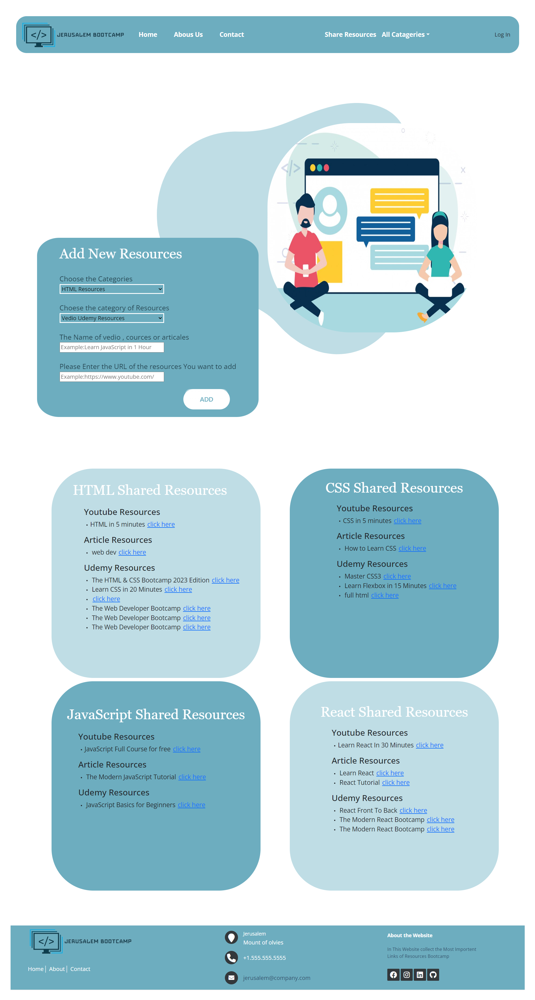

---

### HTML Page Screen

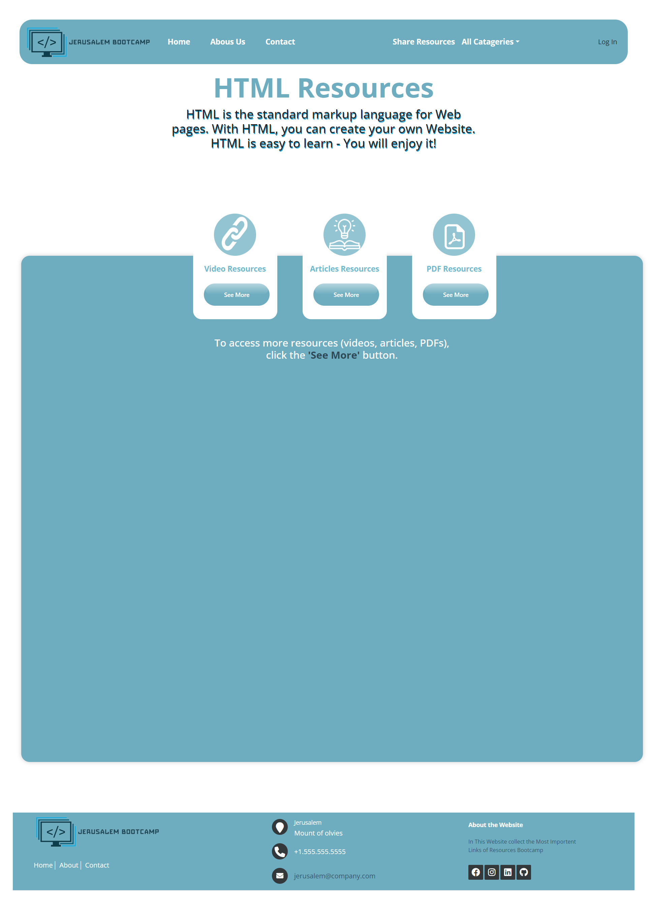

---

### HTML Page Video Screen

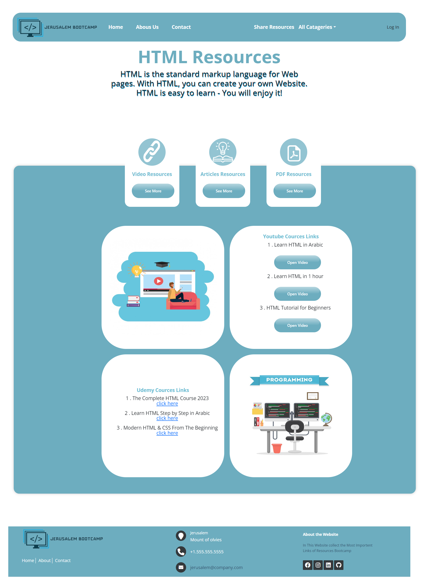

---

### HTML Page Article Screen

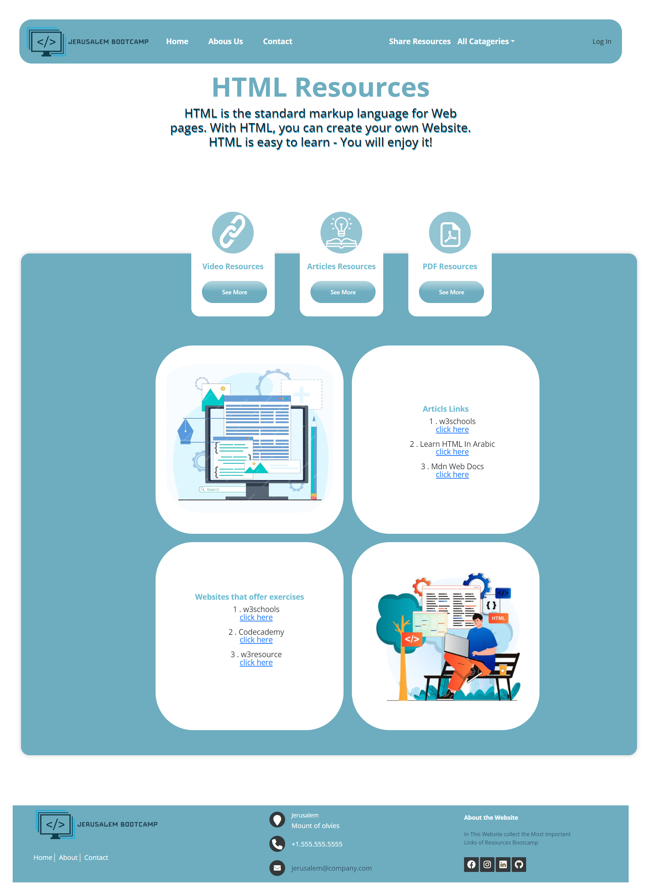

---

### CSS Page Video Screen

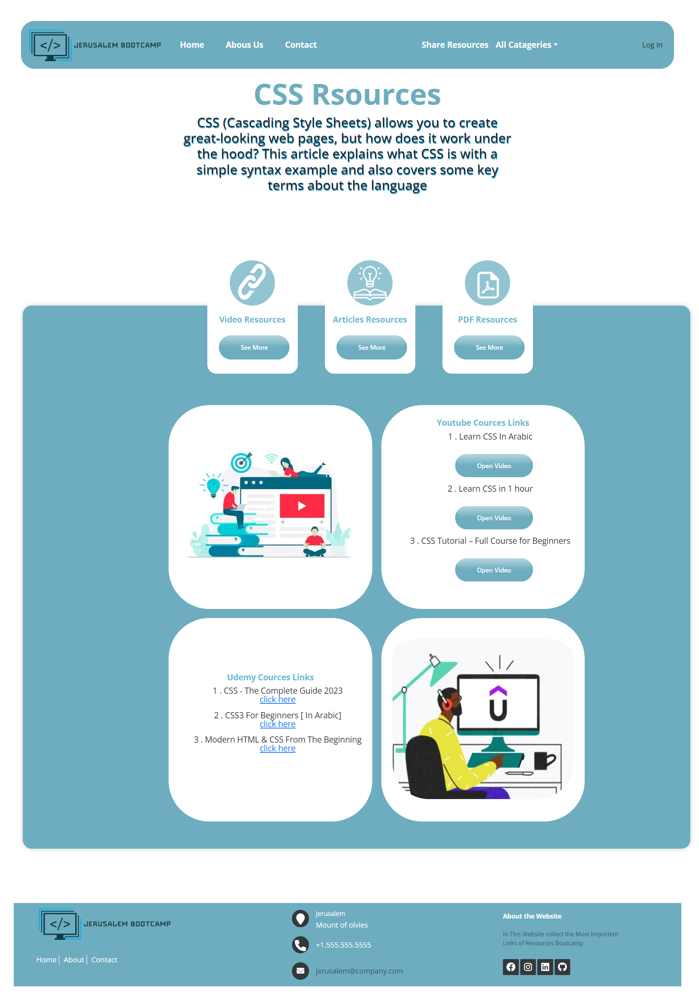

---

### CSS Page Article Screen

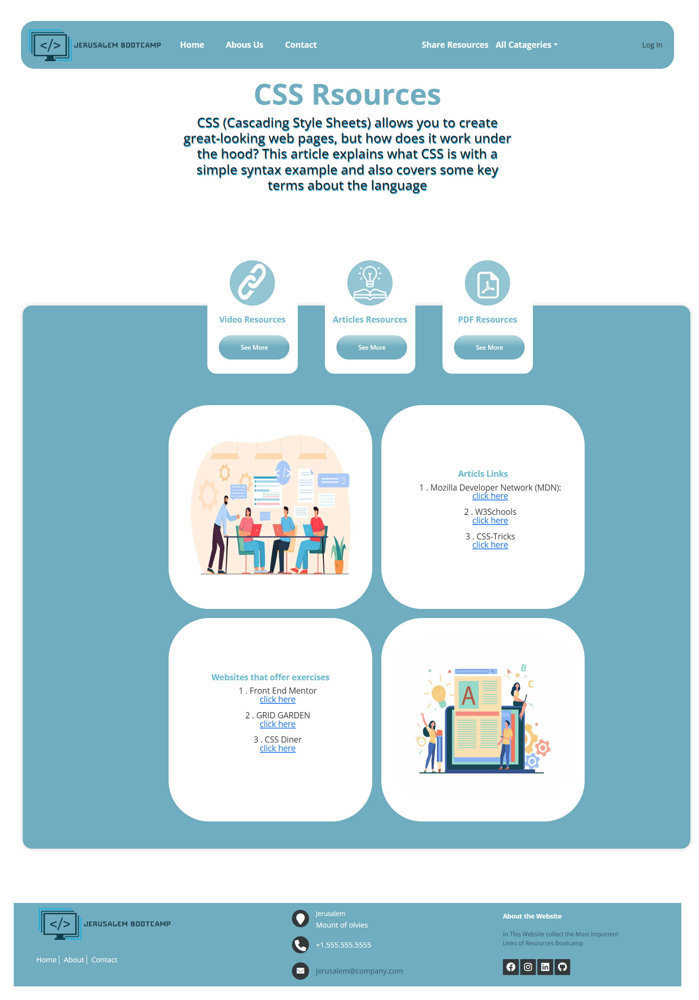

---

### JS Page Video Screen

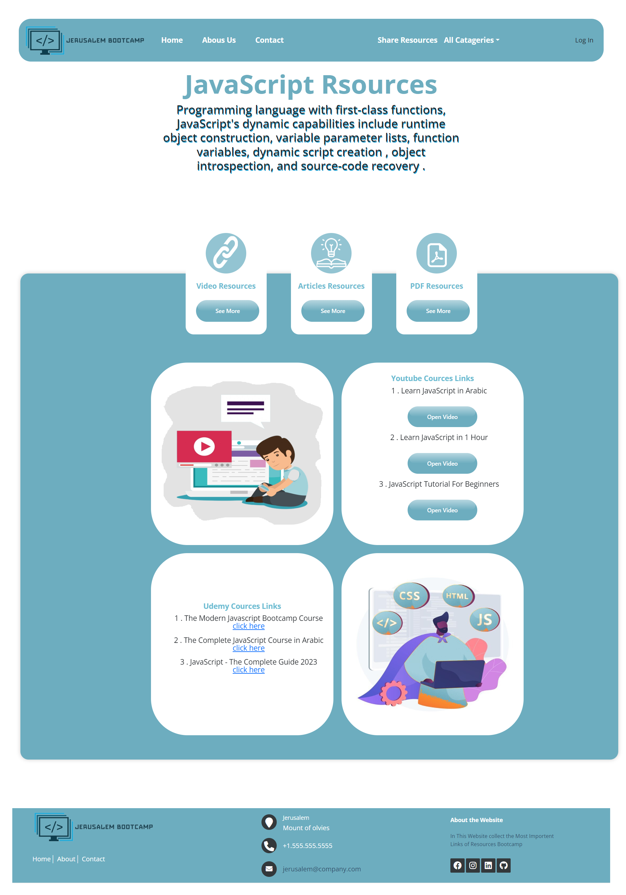

---

### JS Page Article Screen

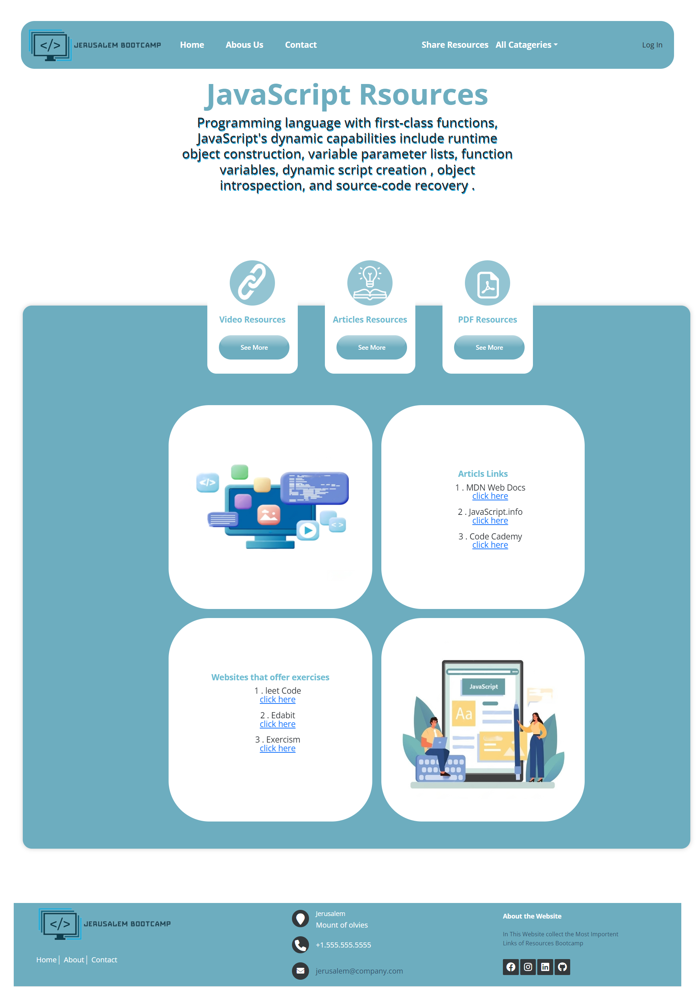

---

### React Page Video Screen

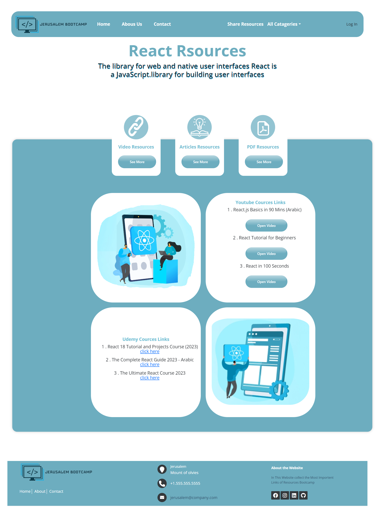

---

### React Page Article Screen

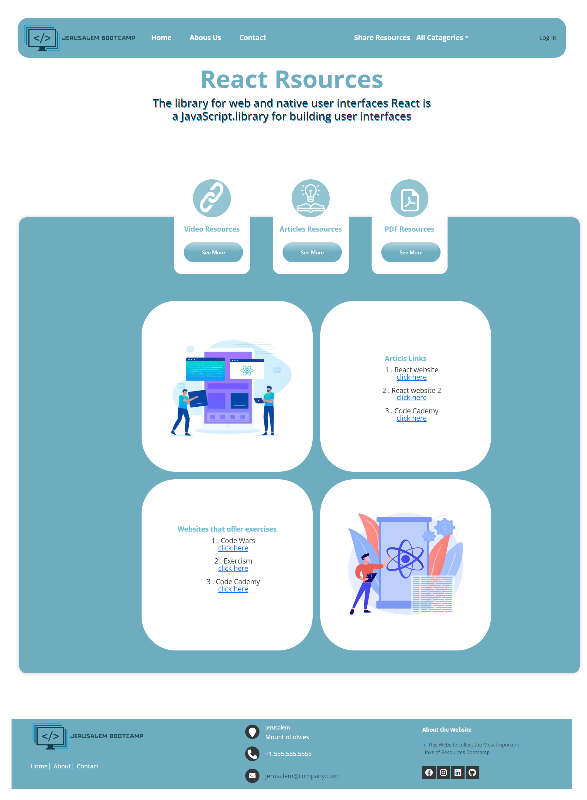

---

## Getting Started

1. Clone the repository from `https://github.com/amalshweiki/bootcamp.git`.
2. Install dependencies with `npm install`.
3. Add the `.env` file based on the `.env.sample` file included in the repository.
4. Run the application using `npm run dev`.

## API Integration

All the API calls are available in the `api.js` file in the `api` folder.

## Context Management

### Authentication Context

- Manages user authentication and stores user details in local storage for persistence.

## Custom Hooks

### `usePageContact`

- Encapsulates the logic for the Catogery page. Common logic for all categories pages(HTML,CSS,JS,React).

### `useLoginForm`

- Manages the logic for the login form.

### `useGlobalAuthContext`

- used to access the AuthContext.
